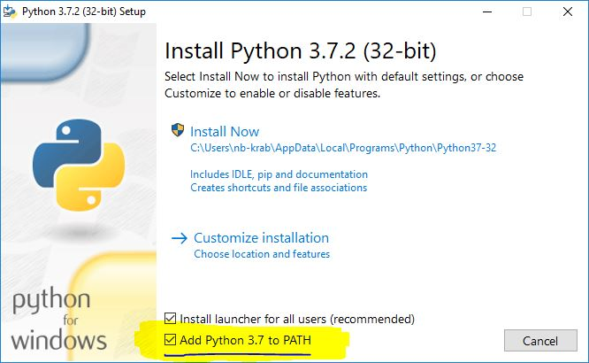

# Prezentace

Sem budeme dávat odkazy na prezentace z kurzu.

# Instalace

Pro tento kurz si potřebujete nainstalovat

- Python 3
- Pandas (pro zpracování dat)
- Jupyter Notebook (tam budeme psát kód)
- Matplotlib a Seaborn (kreslí grafy)
- xlrd (čte Excelové tabulky)

## Instalace na Windows

### 1. 

Otevřete příkazovou řádku. Ve Start menu napište "cmd" (prostě jen začněte psát) nebo ji najděte v menu. Na Windows v angličtině je ve složce "Windows System".
  


### 2. 

V příkazové řádce zkuste napsat `python`. Jestli dostanete chybu, nejspíš Python nemáte nainstalovaný. Jestli se spustí Python a jeho verze je alespoň 3.4, můžete instalaci Pythonu přeskočit a pokračovat instalací balíčků.
  


### 3. 

Ze stránky https://www.python.org/ stáhněte **Python 3**.
  


### 4. 

**Důležité 1** - pokud máte v uživatelském jménu do Windows mezery nebo např. háčky, čárky, zvolte "Customize installation" a vyberte cestu, která nebude uvnitř "C:\Users\Vaše jméno". Jinak můžete mít problém v pozdějších krocích s instalací balíčků.
  
**Důležité 2** - v instalátoru zaškrtněte volbu "Add Python to PATH".
  


### 5.

Je potřeba zavřít a otevřít okno příkazové řádky.

### 6. 

Pomocí příkazu `pip install pandas jupyter matplotlib seaborn xlrd` nainstalujete balíčky, které budeme používat.
  

  
Instalace by měla skončit se slovy `Successfully installed`, po kterých následuje výpis hromady balíčků s verzemi.
  


### 7. 

Nyní zkontrolujte instalaci, viz [Kontrola instalace](#kontrola-instalace)

## MacOS

### 1. 

Nainstalujte Python 3 pomocí `brew install python3`.

- Jestli nemáte `brew`, nainstalujte si jej podle https://brew.sh/
    
### 2. 

Pomocí příkazu `pip install --user pandas jupyter matplotlib seaborn xlrd` nainstalujete balíčky, které budeme používat.

### 3. 

Nyní zkontrolujte instalaci, viz [Kontrola instalace](#kontrola-instalace)

## Linux

### 1. 

Nainstalujte Python 3. Na Ubuntu pomocí `sudo apt install python3 python3-pip`.

### 2. 

Pomocí příkazu `pip install --user pandas jupyter matplotlib seaborn xlrd` nainstalujete balíčky, které budeme používat.

### 3. 

Nyní zkontrolujte instalaci, viz [Kontrola instalace](#kontrola-instalace)

## Kontrola instalace

### 1.

Stáhněte si [testovací skript](https://raw.githubusercontent.com/RobotsAndPeople/data-storytelling/master/test_plot.py).

### 2.

Na Windows můžete zkusit skript spustit dvojklikem. Pokud vše funguje, uvidíte kódové slovo.

Jestli nefunguje spuštění dvojklikem, spusťte skript z příkazové řádky. Například jestli se skript
stáhnul do `Downloads`, spustíte:

```
cd Downloads

# Windows
py -3 test_plot.py

# MacOs, Linux
python3 test_plot.py
```
